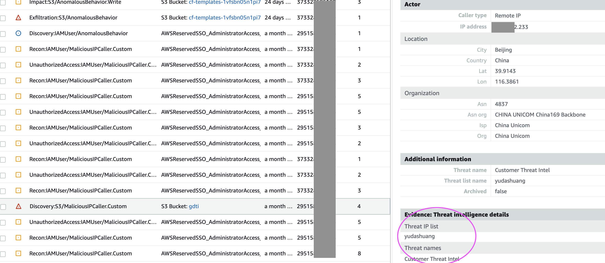

# Amazon Guardduty 3rd party 第三方情报部署脚本
## 本地情报部署 TI in your own account
Need to create a S3 bucket to store TI, then configure the url of S3 into your guardduty Threat List
Only Organization's delegated admin account for Guardduty can execute this action
参数设置 Set Paramter
```
bucketregion=cn-north-1
bucketname=gudarddutyti
region=cn-north-1
filename=threatlist.txt
threatset=mytestset
regions=($(aws ec2 describe-regions --query 'Regions[*].RegionName' --output text --region=$region))
```
CLI命令 Command to create and bucket and upload your TI file
```
aws s3api create-bucket \
    --bucket $bucketname \
    --region $bucketregion \
    --create-bucket-configuration LocationConstraint=$bucketregion
aws s3 cp $filename s3://$bucketname/ --region=$bucketregion
```
在所有regions部署TI Deploy the TI into Guardduty Threat list in each region

```
for region in $regions; do
aws guardduty create-threat-intel-set \
    --detector-id $(aws guardduty list-detectors --output text --query 'DetectorIds' --region=$region)  \
    --name $threatset \
    --format TXT \
    --location $tiurl\
    --activate --region=$region
done
```
## 远程情报商TI部署 TI in vendor's account (invisible for you)
此种场景下情报文件放在情报提供商的S3中,通过对S3的权限配置,给予客户account的Guardduty service role获取文件的能力.
### Step 1 Vendor S3 Configuration
S3 policy, replace the accountid with the customer's accountid, for global account,change the aws-cn to aws in each arn
```
{
    "Version": "2012-10-17",
    "Id": "policyforguardduty",
    "Statement": [
        {
            "Sid": "allowcrossaccount",
            "Effect": "Allow",
            "Principal": {
                "AWS": [
                    "arn:aws-cn:iam::<accountid1>:role/aws-service-role/guardduty.amazonaws.com/AWSServiceRoleForAmazonGuardDuty",
                    "arn:aws-cn:iam::<accountid2>:role/aws-service-role/guardduty.amazonaws.com/AWSServiceRoleForAmazonGuardDuty"
                ]
            },
            "Action": "s3:GetObject",
            "Resource": "arn:aws-cn:s3:::<bucketname>/<filename>.txt"
        }
    ]
}
```
### Step 2 Customer Account Configuration
参数设置 Set Paramter
```
tiurl=s3://threatbook-gdti/threatlist.txt
threatset=yudashuang
regions=($(aws ec2 describe-regions --query 'Regions[*].RegionName' --output text --region=$region))

```
CLI command
```
for region in $regions; do
aws guardduty create-threat-intel-set \
    --detector-id $(aws guardduty list-detectors --output text --query 'DetectorIds' --region=$region)  \
    --name $threatset \
    --format TXT \
    --location $tiurl\
    --activate --region=$region
done
```

告警展示,If the TI was trigger ,will show alert in Guardduty Console as below snapshot:

